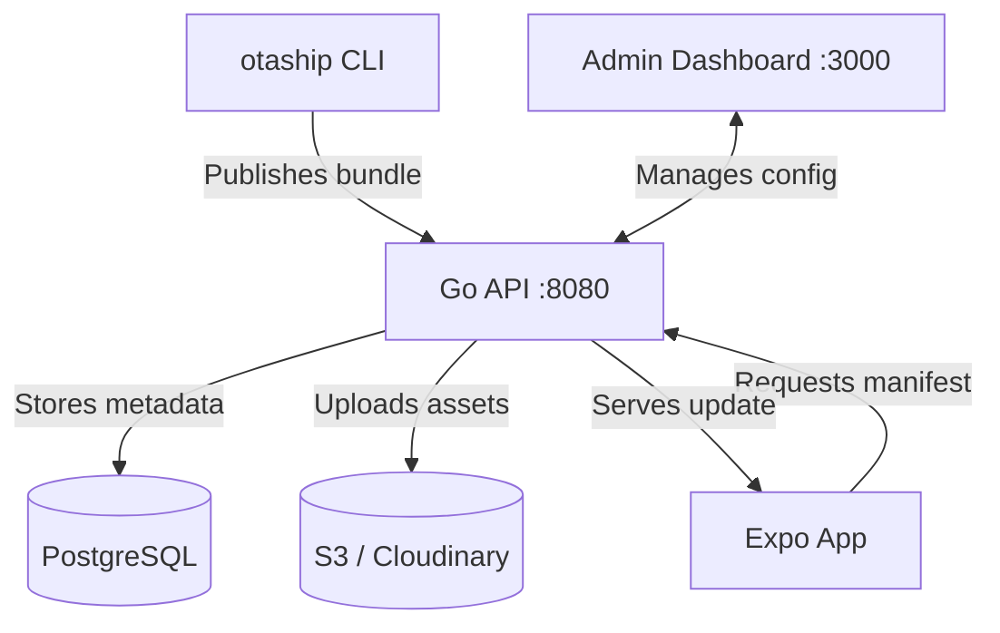

<p align="center">
  
</p>

<h1 align="center">OTAShip</h1>

<p align="center">
  <strong>Self-hosted over-the-air updates for Expo & React Native.</strong><br>
  A free, open-source alternative to EAS Updates — own your update infrastructure.
</p>

<p align="center">
  <a href="https://github.com/vknow360/otaship/actions/workflows/ci.yml">
    
  </a>
  
  
  
  
  
  
</p>

---

## What is OTAShip?

OTAShip lets you push JavaScript updates directly to your Expo / React Native apps without going through app store review. It implements the [Expo Updates protocol](https://docs.expo.dev/technical-specs/expo-updates-1/), so `expo-updates` works out of the box — just point it at your own server instead of Expo's.

You get a **Go backend**, a **SvelteKit admin dashboard**, a **CLI for publishing**, and an **example Expo client** — all wired together with Docker Compose.

## Why Self-Host?

- **Your data, your server.** Update bundles and metadata stay on infrastructure you control.
- **No usage caps.** No per-update pricing, no monthly limits. Push as many updates as you want.
- **Percentage-based rollouts.** Ship to 10% of users first, then ramp up — included, not paywalled.
- **Rollbacks without republishing.** Revert to any previous update or the embedded binary in one command.

## Features

| Category | What you get |
|----------|-------------|
| **Protocol** | Full Expo Updates manifest protocol, including multipart responses and code signing |
| **Storage** | Pluggable: AWS S3, MinIO, or Cloudinary — switch via dashboard settings |
| **Rollouts** | Percentage-based rollouts with per-update control |
| **Rollbacks** | Rollback to any previous update or factory-reset to embedded binary |
| **Dashboard** | Real-time overview, project management, API key management, storage usage |
| **CLI** | `otaship publish` — bundles, uploads, and tracks updates from your terminal or CI/CD |
| **API** | RESTful API with interactive Swagger docs at `/api/docs` |
| **Auth** | Admin bearer tokens for dashboard, scoped `X-API-Key` tokens for CLI/projects |
| **Observability** | Structured logging (JSON/text), download tracking, per-project stats |

## Quick Start

**Prerequisites:** [Docker](https://docs.docker.com/get-docker/) and Docker Compose

```bash
# Clone the repo
git clone https://github.com/vknow360/otaship.git && cd otaship

# Copy environment files
cp backend/.env.example backend/.env
cp admin-dashboard/.env.example admin-dashboard/.env
cp postgres/.env.example postgres/.env

# Start everything
docker compose up -d
```

That's it. The **API** is at `http://localhost:8080` and the **dashboard** at `http://localhost:3000`.

> **Next steps:** Generate an admin token hash, configure your storage provider (S3 or Cloudinary), and create your first project through the dashboard. See the [Backend README](./backend/README.md) for environment variable details.

## OTAShip vs EAS Updates

| | **OTAShip** | **EAS Updates** |
|---|---|---|
| **Hosting** | Self-hosted — your servers | Expo Cloud |
| **Pricing** | Free, forever | Free tier with limits, paid plans |
| **Data storage** | Your PostgreSQL + your S3/Cloudinary | Expo-managed |
| **Rollouts** | Percentage-based, included | Paid tier feature |
| **Rollbacks** | One-command via CLI or dashboard | Manual republish |
| **Code signing** | RSA manifest signing | Supported |
| **Vendor lock-in** | None — standard Expo Updates protocol | Expo ecosystem |

## Architecture



## Project Structure

This is a monorepo with four components:

| Component | Stack | Description | Docs |
|-----------|-------|-------------|------|
| [`backend`](./backend) | Go, Chi, PostgreSQL, SQLC | API server — manifests, uploads, rollouts | [README](./backend/README.md) |
| [`admin-dashboard`](./admin-dashboard) | SvelteKit, Tailwind CSS | Web UI for managing projects and updates | [README](./admin-dashboard/README.md) |
| [`cli`](./cli) | Go, Cobra | Publish updates from terminal or CI/CD | [README](./cli/README.md) |
| [`expo-client`](./expo-client) | Expo, React Native | Example app showing OTA integration | [README](./expo-client/README.md) |

## Contributing

Contributions are welcome! Whether it's a bug fix, a new feature, or documentation improvements — feel free to open an issue or submit a pull request.

If you found OTAShip useful, consider giving it a ⭐ — it helps others discover the project.

## License

Apache License 2.0 — see [LICENSE](./LICENSE) for details.
