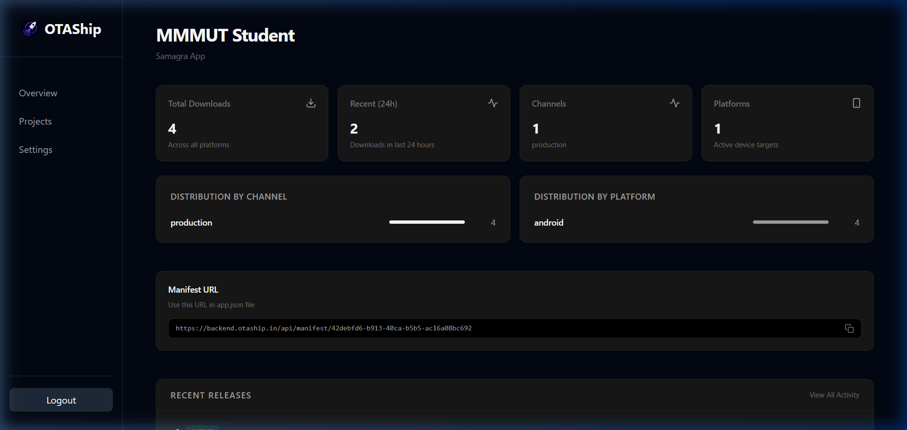

<p align="center">
  
</p>

<h1 align="center">OTAShip</h1>

<p align="center">
  <strong>The open-source, self-hosted alternative to EAS Updates.</strong><br>
  Own your over-the-air (OTA) updates for Expo and React Native applications.
</p>

<p align="center">
  <a href="https://github.com/vknow360/otaship/blob/main/LICENSE">
    
  </a>
  
  
  
</p>

---

## 🚀 What is OTAShip?

OTAShip is a fully self-hostable service that implements the Expo Updates protocol. It allows you to deliver over-the-air (OTA) updates to your React Native applications instantly, without relying on or paying for third-party cloud services like EAS. 

With OTAShip, you retain complete control over your update infrastructure, deployment speed, and data privacy.

## ✨ Key Features

- **True Self-Hosting:** Deploy anywhere using Docker, Kubernetes, or bare metal. No vendor lock-in.
- **Expo Protocol Compatibility:** Full support for the modern Expo Updates protocol (multipart/mixed manifest support).
- **Flexible Storage:** Store your JS bundles and assets on AWS S3, MinIO, or Cloudinary.
- **Gradual Rollouts & Rollbacks:** Control update rollout percentages (e.g., release to 10% of users) and instantly rollback broken updates.
- **Admin Dashboard:** A beautiful SvelteKit-powered web interface to manage projects, API keys, and monitor update history.
- **CI/CD Ready CLI:** A powerful Go-based CLI to publish updates directly from GitHub Actions or your local machine.
- **Security First:** Per-project API keys and support for RSA manifest code signing.

---

## 📸 Dashboard Screenshots

| Projects Overview | Project Details & Rollbacks |
|:---:|:---:|
|  |  |

---

## ⚡ Quick Start

### Prerequisites
- Docker and Docker Compose
- (For manual setup: Go 1.25+, PostgreSQL 16+, Node.js 18+)

### Using Docker Compose

Get the backend and database running in minutes:

1. Clone the repository:
   ```bash
   git clone https://github.com/vknow360/otaship.git
   cd otaship
   ```

2. Configure environment variables for the backend:
   ```bash
   cp backend/.env.example backend/.env
   # Edit backend/.env to add your Cloudinary/S3 keys and set ADMIN_TOKEN_HASH
   ```

3. Start the services:
   ```bash
   docker-compose up -d
   ```
   *The backend will automatically run database migrations and start on `localhost:8080`.*

### Manual Setup & Specific Guides

For detailed setup instructions for each component, check their respective guides:

| Component | Description | Guide |
|-----------|-------------|-------|
| **Backend** | The core Go API and manifest server | [Backend Guide](./backend/README.md) |
| **CLI** | The `otaship` command-line tool for publishing | [CLI Guide](./cli/README.md) |
| **Admin Dashboard** | SvelteKit web interface for management | [Dashboard Guide](./admin-dashboard/README.md) |
| **Expo Client** | Example React Native app integration | [Client Guide](./expo-client/README.md) |

---

## 🏗️ Architecture

```mermaid
graph TD
    CLI[OTAShip CLI (Publish)] -->|Uploads Bundle| Backend[Go Backend API]
    Dashboard[Admin Dashboard] <-->|Manages Projects/Keys| Backend
    Backend -->|Stores Metadata| Postgres[(PostgreSQL)]
    Backend -->|Stores Assets| Storage[(AWS S3 / Cloudinary)]
    App[React Native App] -->|Requests Update| Backend
```

---

## 🤝 Contributing

Contributions are always welcome! Whether it's reporting a bug, discussing improvements, or submitting a pull request, we appreciate your help in making OTAShip better.

---

## 📄 License

This project is licensed under the Apache License 2.0. See the [LICENSE](./LICENSE) file for details.
