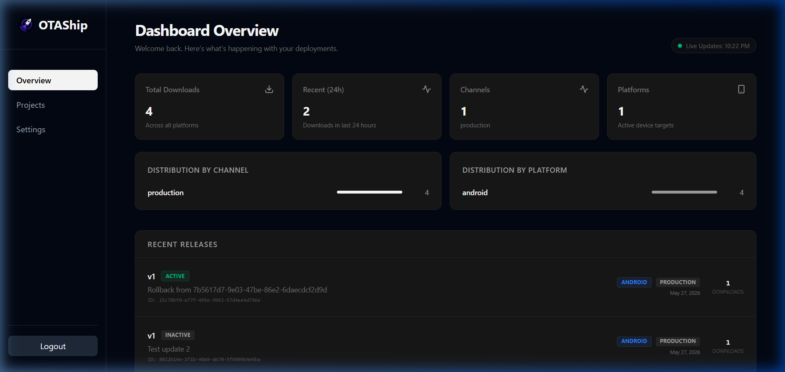
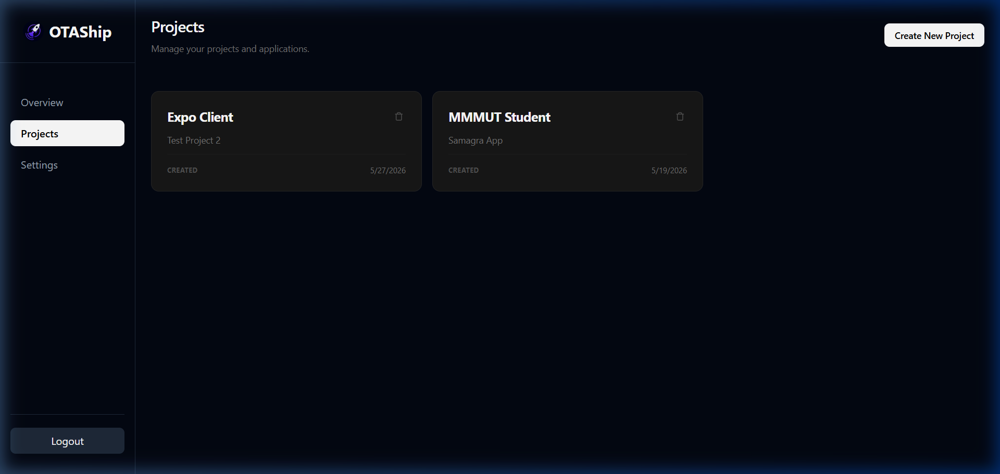
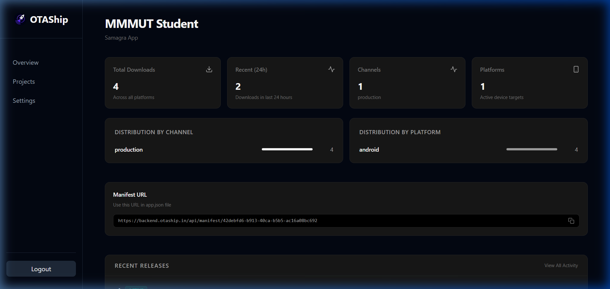
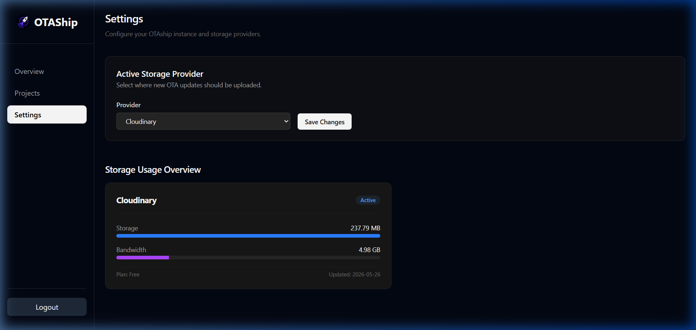

# OTAShip — Admin Dashboard

The web interface for managing your OTAShip instance. Built with SvelteKit and Tailwind CSS.

→ [Back to main README](../README.md)

## Screenshots

### Dashboard Overview

Global stats at a glance — total downloads, recent activity, distribution by channel and platform, and recent releases.

<p align="center">
  
</p>

### Projects

Create and manage your Expo projects. Each project gets its own API keys and update history.

<p align="center">
  
</p>

### Project Detail

Per-project stats, manifest URL for your `app.json`, and release history with rollback controls.

<p align="center">
  
</p>

### Settings

Switch between storage providers and monitor storage usage and bandwidth.

<p align="center">
  
</p>

## Tech Stack

| | |
|---|---|
| **Framework** | [SvelteKit](https://svelte.dev/docs/kit) (Svelte 5) |
| **Styling** | [Tailwind CSS](https://tailwindcss.com/) v4 |
| **Production** | [adapter-node](https://svelte.dev/docs/kit/adapter-node) (standalone Node.js server) |
| **Package Manager** | pnpm |

## What You Can Do

The dashboard connects to the OTAShip backend REST API and gives you a visual interface for:

- **Overview** — Total downloads, recent activity, distribution by channel and platform
- **Projects** — Create, edit, delete projects; view per-project stats
- **Releases** — Browse update history, trigger rollbacks, adjust rollout percentages
- **API Keys** — Generate and revoke `X-API-Key` credentials for the CLI
- **Settings** — View active storage provider and storage usage

## Local Development

> Requires Node.js 18+ and pnpm. The backend must be running.

```bash
cd admin-dashboard
cp .env.example .env
pnpm install
pnpm dev
```

The dashboard starts at `http://localhost:5173`.

### Environment Variables

| Variable | Description |
|----------|-------------|
| `PUBLIC_API_URL` | URL of the OTAShip backend (default: `http://localhost:8080`) |
| `ORIGIN` | The dashboard's own URL in production (e.g., `https://dashboard.yourdomain.com`). Required by SvelteKit to validate request origins — without it, you'll get CORS / 403 errors on form submissions. |

### Authentication

The dashboard uses bearer token authentication. When you log in, enter the plaintext password that corresponds to the `ADMIN_TOKEN_HASH` configured in your backend's `.env`.

## Production Build

```bash
pnpm build
node build
```

This compiles the SvelteKit app into a standalone Node.js server using `adapter-node`. The Docker Compose setup in the root repo handles this automatically.

## Project Structure

```
admin-dashboard/
├── src/
│   ├── routes/              # SvelteKit pages
│   │   ├── login/           # Login page
│   │   ├── projects/        # Project list + detail views
│   │   ├── releases/        # Release history
│   │   ├── settings/        # Storage and config settings
│   │   └── +page.svelte     # Dashboard overview (home)
│   ├── lib/                 # Shared components and utilities
│   │   ├── api.js           # Backend API client
│   │   ├── Sidebar.svelte   # Navigation sidebar
│   │   ├── StatsGrid.svelte # Stats cards component
│   │   └── ...              # Modals, buttons, and other components
│   └── app.html             # Base HTML template
├── static/                  # Favicon and static assets
├── svelte.config.js         # SvelteKit config (adapter-node)
└── package.json             # Dependencies
```
